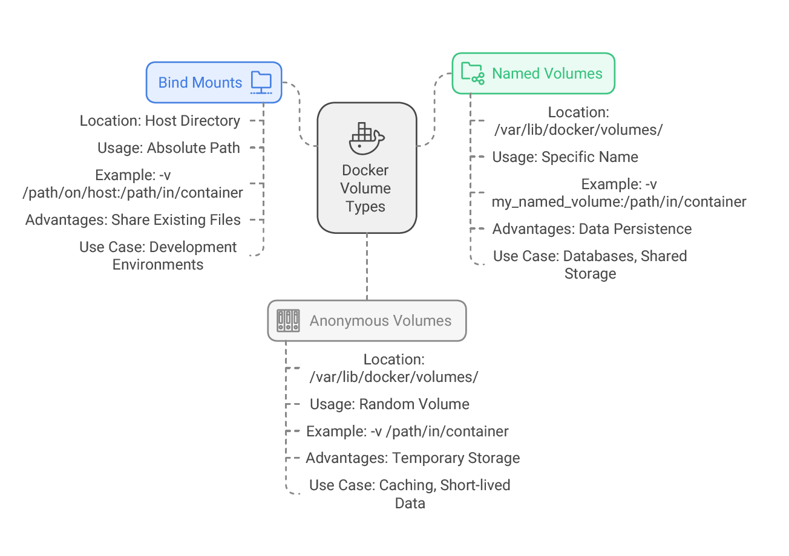

# Learn VOLUME vs Bind Mounts



---

## Step 1: Introduction
1. Learn the differences between Docker Volumes and Bind Mounts for **non-empty** directories.
2. Create a Docker image with Nginx static content.
3. Mount a volume to a container using `--mount` (type=volume).
4. Use a bind mount to a container with `--mount` (type=bind).
5. Observe differences:
   - Volume preserves previous container data.
   - Bind mount obscures previous container data.

## Step 2: Create a new Docker Image for this demo
### Step 2.1: Review Dockerfile
```bash
# Use nginx:alpine-slim as base Docker Image
FROM nginx:alpine-slim

# OCI Labels
LABEL org.opencontainers.image.authors="KMS Healthcare"
LABEL org.opencontainers.image.title="Demo: Docker Volumes vs Bind Mounts"
LABEL org.opencontainers.image.description="Learn the Differences Between Docker Volumes and Bind Mounts When Mounted to a Non-Empty Directory in a Container"
LABEL org.opencontainers.image.version="1.0"

# Using COPY to copy a local file
COPY ./static-content/ /usr/share/nginx/html
```

### Step 2.2: Review Static Content that will be used for Nginx
- **Folder:** Dockerfiles/static-content
```bash
ls -laR $(git rev-parse --show-toplevel)/a21-Docker-VOLUMES-vs-BIND-MOUNTS-NonEmptyDIR/Dockerfiles/static-content

# Expected Output:
# ├── app1
# │   └── index.html
# ├── file1.html
# ├── file2.html
# ├── file3.html
# ├── file4.html
# ├── file5.html
# └── index.html
```

### Step 2.3: Build a Docker Image
```bash
# Change directory
cd $(git rev-parse --show-toplevel)/a21-Docker-VOLUMES-vs-BIND-MOUNTS-NonEmptyDIR/Dockerfiles

# Build the Docker image
docker build -t mynginx-nonemptydir:v1 .

# Run Docker Container and Verify
docker run --name=nonemtpydir-demo1 -p 8095:80 -d mynginx-nonemptydir:v1

# List Docker Containers
docker ps -f "name=demo"

# List the files/directories inside container and Verify
docker exec -it nonemtpydir-demo1 /bin/sh -c "ls -laR /usr/share/nginx/html"

# Observation:
# All static files present

## Sample Output
# /usr/share/nginx/html # ls
# 50x.html    file1.html  file3.html  file5.html
# app1        file2.html  file4.html  index.html

# Observation:
# We have all our static content present and accessible
```

Access Application http://localhost:8095

## Step 3: Mount Volume to a Container with `type=volume`
- If you start a container which creates a new volume, and the container has files or directories in the directory to be mounted such as `/app/`, Docker copies the directory's contents into the volume.
- The container then mounts and uses the volume, and other containers which use the volume also have access to the pre-populated content.
```bash
# Verify any existing volumes present
docker volume ls

# Single Line Format: Using --mount option with volume location in container as /usr/share/nginx/html
docker run --name nonemtpydir-volume-demo -p 8096:80 --mount type=volume,source=myvol103,target=/usr/share/nginx/html -d mynginx-nonemptydir:v1

# List Docker Containers
docker ps -f "name=demo"

# Connect to Container and verify
docker exec -it nonemtpydir-volume-demo /bin/sh -c "ls -laR /usr/share/nginx/html"

# Observation:
# 1. We should see a new docker volume mount created in container
# 2. Whatever earlier present "/usr/share/nginx/html" from docker image copied successfully to Docker Volume mounted in container at path "/usr/share/nginx/html"
# 3. NO DATA LOSS
# 4. THIS IS THE GREATEST ADVANTAGE

# Inspect Docker Container
docker inspect --format='{{json .Mounts}}' nonemtpydir-volume-demo | jq

# Observation:
# We have all our static content present and accessible
```

Access Application http://localhost:8096

## Step 4: Mount Volume to a Container with `type=bind`
```bash
# Change directory
cd $(git rev-parse --show-toplevel)/a21-Docker-VOLUMES-vs-BIND-MOUNTS-NonEmptyDIR/myfiles

# Single line Format: Using --mount option with type=bind and target location in container as /usr/share/nginx/html
docker run --name nonemtpydir-bind-demo -p 8097:80 --mount type=bind,source="$(pwd)"/static-content,target=/usr/share/nginx/html -d nginx:alpine-slim ### mynginx-nonemptydir:v1

# List Docker Containers
docker ps -f "name=demo"

# List the files/directories inside container and Verify
docker exec -it nonemtpydir-bind-demo /bin/sh -c "ls -laR /usr/share/nginx/html"

### SAMPLE OUTPUT
# /usr/share/nginx/html # ls
# local1.html
# /usr/share/nginx/html #

# Observation:
# 1. All data present inside container at location "/usr/share/nginx/html" is obscured
# 2. Only content from local directory from HOST_MACHINE is present in "/usr/share/nginx/html"
# 3. This can be beneficial, such as when you want to test a new version of your application without building a new image, just by creating new container and updated code bind mount for that container
# 4. VERY IMPORTANT NOTE: We should be very careful when mounting Bind Mounts to non-emtpy directories in a container, else it would take down our application
# 5. Pros and cons will be completely based on the usecase we are using in our organization

# Observation:
# 1. We have all our static content present from HOST MACHINE and accessible
# 2. File system is READ-WRITE

# Inspect Docker Container
docker inspect --format='{{json .Mounts}}' nonemtpydir-bind-demo | jq
```

Access Application:
- http://localhost:8097 `expect ERROR returns`
- http://localhost:8097/local1.html

## Step-5: Clean-Up
```bash
# Delete All Containers
docker rm -f $(docker ps -aq -f "name=demo")

# Delete All Docker Images
docker rmi $(docker image ls -qa --filter 'reference=*nginx*')

# Remove specific volume myvol103
docker volume rm myvol103
```

## Conclusion

[Volume](https://docs.docker.com/engine/storage/volumes/) have several advantages over [Bind mounts](https://docs.docker.com/engine/storage/bind-mounts/):

- **Portability**: Easier to back up, migrate, and manage via Docker CLI or API.
- **Cross-Platform**: Supports Linux and Windows containers.
- **Sharing**: Safely share volumes across multiple containers.
- **Flexibility**: Use volume drivers for remote storage, encryption, or added features.
- **Pre-Population**: New volumes can be pre-filled by a container.
- **Performance**: Faster than bind mounts on Docker Desktop (Mac/Windows).

---
