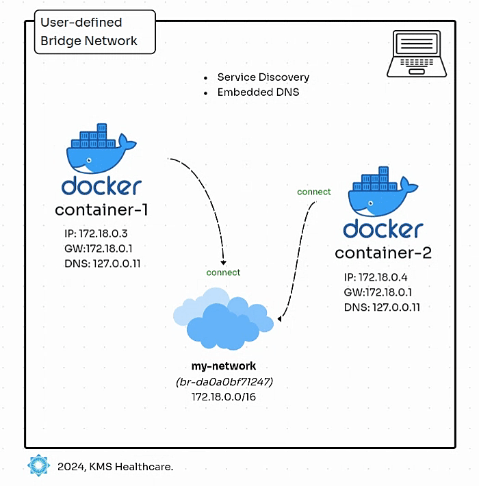

# Learn NETWORKING



## Introduction

- This guide provides an introduction to **User-defined Bridge** network in Docker
- Demonstrates how to connect containers to them for communication.
- **User-defined Bridge** network offer greater control and flexibility compared to the **Default Bridge** network.

## SCENARIO 1: Use `docker network connect`

### Step 1: Create a User-Defined Bridge Network
```bash
# Create a custom bridge network
docker network create demo-bridge-network --driver bridge

# Verify the network was created
docker network ls

# Inspect the network
docker network inspect demo-bridge-network | jq
```

### Step 2: Run Standalone Containers
```bash
# Run first container
docker run -dit --name busybox1 busybox:latest

# Run second container
docker run -dit --name busybox2 busybox:latest
```

### Step 3: Connect Containers to the Custom Network

Pre-connectivity Test

```bash
# Execute connectivity test from busybox1 --> busybox2
docker exec busybox1 ping -c 4 busybox2

# Execute connectivity test from busybox2 --> busybox1
docker exec busybox2 ping -c 4 busybox1
```

```bash
# Connect first container to the network
docker network connect demo-bridge-network busybox1

# Connect second container to the network
docker network connect demo-bridge-network busybox2

# Inspect the network
docker network inspect demo-bridge-network | jq
```

### Step 4: Post-Connectivity Test
```bash
# Execute connectivity test from busybox1 --> busybox2
docker exec busybox1 ping -c 4 busybox2

# Execute connectivity test from busybox2 --> busybox1
docker exec busybox2 ping -c 4 busybox1
```

## **Stop and remove containers and network**

```bash
# Remove containers
docker rm -f busybox1
docker rm -f busybox2
```

## SCENARIO 2: Use `--network` parameter

### Step 1: Run Containers with Network Specification
```bash
# Run first container with network parameter
docker run -dit --name busybox3 --network demo-bridge-network busybox:latest

# Run second container with network parameter
docker run -dit --name busybox4 --network demo-bridge-network busybox:latest
```

### Step 2: Connectivity Test
```bash
# Execute connectivity test
docker exec busybox3 ping -c 4 busybox4
docker exec busybox4 ping -c 4 busybox3
```

## **Stop and remove containers and network**

```bash
# Remove containers
docker rm -f busybox3
docker rm -f busybox4

# Remove network
docker network rm demo-bridge-network
```

## **Commands used**

| **Command**         | **Description**                                    |
|--------------------|---------------------------------------------------|
| `docker network create` | Create a user-defined bridge network               |
| `docker network ls`     | List all available Docker networks                |
| `docker run --network`  | Attach a container to a user-defined network      |
| `docker exec`           | Access the shell of a running container           |
| `ping`                  | Test connectivity between two containers         |


## Conclusion

Docker networking provides flexible and powerful ways to connect containers:
- **User-defined Bridge** offer improved isolation and communication
- Containers can be connected to networks dynamically or at runtime
- Network connectivity can be easily tested using basic network tools

### Best Practices
- Use **User-defined Bridge** for better container isolation
- Leverage network aliases for more complex networking scenarios
- Always consider security when configuring container networks
